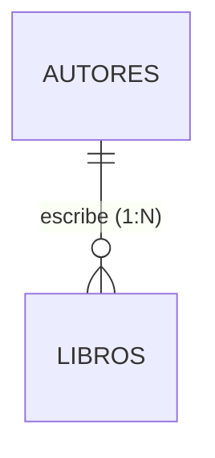
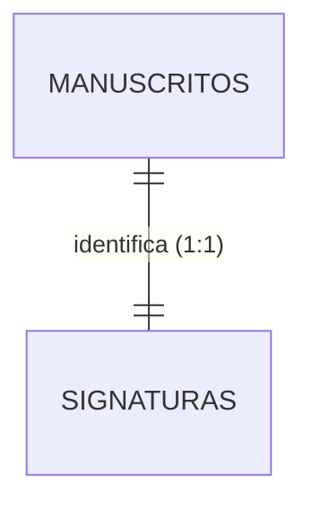
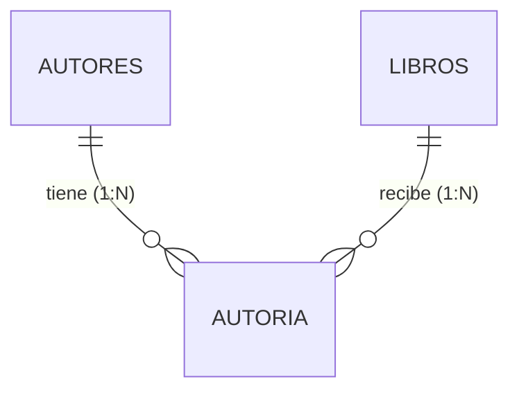

# Construye tu propia base de datos
### *herramientas digitales para el análisis de textos*
### *(6° edición)*

**Andrés Echavarría**
*Centre National de la Recherche Scientifique*
*Université Sorbonne Nouvelle*


Escuela de doctorado

**Universidad Complutense de Madrid**

---

<!-- _class: lead -->


---

<center>
  
</center>
<span class="cite">© 2026 International Crisis Group</span>

<div style="background-color: #2c313c; padding: 10px 15px; border-radius: 8px; border-left: 5px solid #e5c07b; text-align: left;">
  <h3 style="color: #e5c07b; margin: 0; font-size: 0.9em; font-family: 'Georgia', serif;">Observar la dinámica</h3>
  <ul style="font-size: 0.7em; margin: 5px 0 0 20px; color: #abb2bf; line-height: 1.35;">
    <li>¿Qué está ocurriendo en este espacio?</li>
    <li>¿Cómo podemos delimitar este acontecimiento?</li>
    <li>¿Dónde termina la dinámica y dónde comienza nuestra observación?</li>
  </ul>
</div>

---

## La dinámica frente al dato

- **La dinámica:** La realidad es un flujo continuo, polifónico y complejo (ej. una manifestación popular, la recepción de un texto).
- **La intervención:** Para poder investigar, debemos aislar **unidades discretas** de ese continuo.
- **El dato como construcción:** El dato no preexiste a la mirada del investigador; es capturado (*capta*) bajo sesgos y preguntas teóricas concretas.

<span class="cite">Drucker, J. (2011). "Humanities Approaches to Graphical Display". DHQ.</span>

---

## Editorialización (*entender lo digital como un espacio real*)

> "La editorialización es el conjunto de dinámicas —interacciones de las acciones humanas con el entorno tecnológico— que producen y estructuran el espacio digital."
>
> — **Marcello Vitali-Rosati** (2018)

<span class="cite">Vitali-Rosati, M. (2018). *On Editorialization*.</span>

---

## El gesto de describir: entidades y atributos

Para organizar el conocimiento, dividimos el dominio en:

*   **Entidad:** El concepto u objeto sustantivo que queremos estudiar (ej. un autor, un libro).
*   **Atributo:** Las características específicas que definen o describen a esa entidad.
*   **Tipo de dato:** El molde formal que la computadora impone a cada atributo para poder procesarlo racionalmente.

---

## 1. Primer ejemplo: describir una `persona`

Modelamos un autor o investigador de nuestro corpus:

*   **Nombre:** Texto libre `(String)`
    *   *Ejemplo:* `"Cervantes, Miguel de"`
*   **Año de nacimiento:** Número entero `(Integer)`
    *   *Ejemplo:* `1547` (permite ordenar cronológicamente)
*   **¿Es de nacionalidad española?:** Lógico binario `(Boolean)`
    *   *Ejemplo:* `True` (Verdadero)
*   **Rol principal:** Opción cerrada `(Enum)`
    *   *Ejemplo:* `Poeta` (de una lista: *Dramaturgo, Poeta, Novelista, Impresor*)

---

## Explicación: ¿qué es un tipo de dato?

Es el molde formal que define qué clase de información almacena un atributo y qué operaciones lógicas o matemáticas puede realizar la computadora con ella:

*   **Texto (String):** Cadenas libres de caracteres (letras, palabras, símbolos).
*   **Entero (Integer):** Números sin decimales, útiles para contar o indexar.
*   **Decimal (Float/Double):** Números con decimales (ej. coordenadas geográficas).
*   **Booleano (Boolean):** Estados binarios excluyentes de Verdadero o Falso.
*   **Enumerados (Enum):** Listas predefinidas y cerradas de opciones.

---

## ¿Qué es la modelización?

> "La modelización consiste en producir una representación formalizada y simplificada de lo real para responder a una necesidad cognitiva o práctica específica."
>
> — **M. Vitali-Rosati, B. Bachimont y P. Gançarski** (2022)

<span class="cite">Vitali-Rosati, M. et al. (2022). "Modèles : du monde réel au monde numérique". *Intelligibilité du numérique*.</span>

---

## 2. Segundo ejemplo: describir un `libro`

Modelamos las obras literarias de interés:

*   **Título:** Texto libre `(String)`
    *   *Ejemplo:* `"La Galatea"`
*   **Número de páginas:** Número entero `(Integer)`
    *   *Ejemplo:* `372`
*   **¿Es manuscrito?:** Lógico binario `(Boolean)`
    *   *Ejemplo:* `False` (Falso)
*   **Lengua original:** Vocabulario controlado `(Enum)`
    *   *Ejemplo:* `Español` (de una lista de códigos ISO: *ES, FR, IT, EN*)

---

## 3. Tercer ejemplo: describir un `lugar`

Modelamos la geografía de la producción literaria:

*   **Nombre del municipio:** Texto libre `(String)`
    *   *Ejemplo:* `"Alcalá de Henares"`
*   **Coordenadas geográficas (latitud/longitud):** Números decimales `(Float/Double)`
    *   *Ejemplo:* `40.481979` , `-3.363524`
*   **País actual:** Código cerrado de país `(Enum/String)`
    *   *Ejemplo:* `"ES"`

---

## 4. Cuarto ejemplo: describir una `institución`

Modelamos las editoriales o bibliotecas del corpus:

*   **Nombre oficial:** Texto libre `(String)`
    *   *Ejemplo:* `"Juan de la Cuesta"`
*   **Año de fundación:** Número entero `(Integer)`
    *   *Ejemplo:* `1604`
*   **Tipo de institución:** Opciones predefinidas `(Enum)`
    *   *Ejemplo:* `Imprenta` (de una lista: *Biblioteca, Imprenta, Universidad, Archivo*)

---

## El problema del formato y la sintaxis (I): la ambigüedad del texto libre

¿Basta con asociar claves y valores de forma libre? El texto es flexible pero genera inconsistencias graves:

*   **El caos ortográfico en fechas:**
    *   `"10 de marzo de 1940"` (español) vs. `"March 10, 1940"` (inglés).
    *   `"10/03/1940"`: ¿10 de marzo (formato europeo) o 3 de octubre (formato anglosajón)?
*   **La solución en bases de datos:** Usar el estándar **ISO 8601** (`AAAA-MM-DD`).
    *   `1940-03-10` y `1940-10-03` son inequívocos y legibles por cualquier máquina. En SQL se representa bajo el tipo **`DATE`**.

---

## El problema del formato y la sintaxis (II): el cálculo del tiempo y del espacio

*   **El problema de almacenar estados variables:**
    *   Si definimos `edad: 84` (ejemplo de Harper Lee), ¿hablamos de 84 años o 84 días? Además, la edad cambia constantemente.
    *   **Principio de diseño:** No almacenes datos derivados o temporales. Almacena el dato inmutable (ej. `fecha_nacimiento`). El motor SQL calculará la edad dinámicamente al hacer la consulta.
*   **La precisión espacial (coordenadas):**
    *   En lugar de `"París"` (que puede ser París, Texas o París, Francia), usamos latitud y longitud.
    *   Para evitar la pérdida de precisión, SQL ofrece tipos de datos decimales exactos como **`DECIMAL(9,6)`** o **`NUMERIC`**.

---

## El problema del formato y la sintaxis (III): identificadores y no-cálculo

**Regla de oro de las bases de datos:** No todo lo que tiene números es un tipo de dato numérico en SQL.

*   **¿Se pueden hacer operaciones matemáticas con el campo?**
    *   Si la respuesta es **no**, no es un número.
    *   **Ejemplos:** Códigos postales (`28015`), números de teléfono, códigos ISBN, identificadores DOI o ID autoincrementales.
*   **El peligro de los ceros a la izquierda:**
    *   Si almacenas el código postal de Barcelona `"08001"` como un entero (`INTEGER`), la máquina guardará `8001`, corrompiendo el dato.
    *   **Solución:** Estos campos deben ser de tipo texto (**`VARCHAR`** o **`TEXT`** en SQL) para proteger su formato y caracteres especiales.

---

## El problema del formato y la sintaxis (IV): correspondencia con tipos de datos SQL

| Dato humano | Atributo propuesto | Tipo de dato SQL (SQLite/Postgres) | Operaciones permitidas |
| :--- | :--- | :--- | :--- |
| Nombre o título | `nombre_autor` | **`VARCHAR(255)`** o **`TEXT`** | Búsqueda por subcadena, ordenación |
| Páginas o año | `paginas` | **`INTEGER`** | Sumas, promedios, comparaciones |
| Coordenadas | `latitud` | **`DECIMAL(9,6)`** o **`REAL`** | Distancias geográficas, mapas |
| Código postal o ISBN | `codigo_postal` | **`VARCHAR(10)`** o **`TEXT`** | Indexación, coincidencia exacta |
| Fecha exacta | `fecha_impresion` | **`DATE`** | Ordenación cronológica, intervalos |

---

## El problema de la semántica e interoperabilidad

¿Cómo nos aseguramos de que nuestras claves signifiquen lo mismo para otros investigadores?

*   **Vocabularios comunes:** Usar esquemas normalizados como **Dublin Core** o **DataCite**.
*   **Traducción filológica:**
    *   En lugar de un campo casero `nom`, usamos el estándar `dc:creator` (Creador).
    *   En lugar de `fecha`, usamos `dc:date` (Fecha) o `dc:created` (Creado).
    *   En lugar de `lugar`, usamos `dc:coverage` o `GeoLocation` (Datacite).

---

<!-- _style: "font-size: 20px; table { font-size: 0.65em; }" -->

## De las fichas aisladas al caos de la tabla única

Si intentamos registrar la información en una sola tabla plana (tipo Excel):

| Título Libro | Autor (Persona) | Año Nac. | Lugar Nac. | Editorial | Tipo Edit. |
| :--- | :--- | :--- | :--- | :--- | :--- |
| *La Galatea* | M. de Cervantes | 1547 | Alcalá | Blas de Robles | Imprenta |
| *Don Quijote* | M. de Cervantes | 1547 | Alcalá | Juan de la Cuesta | Imprenta |

*   **Redundancia:** Repetimos los datos de Cervantes en cada libro.
*   **Riesgo de inconsistencia:** Si corregimos la fecha de Cervantes en una fila pero no en otra, rompemos la integridad de la base de datos.

---

## El modelo relacional al rescate

*   **Separar entidades:** Creamos una tabla para `PERSONAS`, otra para `LIBROS` y otra para `EDITORIALES`.
*   **Clave primaria (Primary Key - PK):** Un identificador único e inalterable para cada fila (ej. `ID_Persona = 1`).
*   **Clave foránea (Foreign Key - FK):** Una columna en la tabla `LIBROS` que almacena el `ID` de su autor correspondiente.
*   *La información de la persona se almacena una sola vez. Los libros solo guardan la clave de enlace.*

---

<!-- _style: "font-size: 19px; table { font-size: 0.65em; }" -->

## Ejercicio práctico: el diccionario de datos

Antes de programar, definimos la estructura exacta. Esto es el **Diccionario de Datos**:

### Entidad: `LIBROS`

| Nombre del campo | Tipo de dato | Restricción / propiedad | Descripción |
| :--- | :--- | :--- | :--- |
| `id_libro` | **Entero (PK)** | Único, Autoincremental | Clave primaria del libro |
| `titulo` | **Texto (String)** | Obligatorio | Título de la obra |
| `paginas` | **Entero** | Mayor que cero | Número de páginas físicas |
| `fk_autor` | **Entero (FK)** | Apunta a `PERSONAS(id_persona)` | Enlace lógico al autor |

---

<!-- _style: "font-size: 19px;" -->

## Tipos de relaciones (I): uno a muchos (1:N)

Un registro de la tabla A se asocia con muchos de la tabla B, pero cada registro de B solo se conecta con uno de A.



*Representación en tablas de la base de datos (SQL):*
```text
[Tabla: AUTORES]                  [Tabla: LIBROS]
+----------+--------------+       +----------+---------------+----------+
| id_autor | nombre       | (PK)  | id_libro | titulo        | fk_autor | (FK)
+----------+--------------+       +----------+---------------+----------+
| 1        | Cervantes    |       | 10       | Don Quijote   | 1        | -> Cervantes
| 2        | Lope de Vega |       | 11       | La Galatea    | 1        | -> Cervantes
+----------+--------------+       | 12       | Fuenteovejuna | 2        | -> Lope de Vega
                                  +----------+---------------+----------+
```

---

<!-- _style: "font-size: 19px;" -->

## Tipos de relaciones (II): uno a uno (1:1)

Cada registro de la tabla A se conecta de forma exclusiva con un único registro de la tabla B.



*Representación en tablas de la base de datos (SQL):*
```text
[Tabla: MANUSCRITOS]                [Tabla: SIGNATURAS]
+---------------+---------------+   +---------------+---------------+
| id_manuscrito | titulo        |   | id_signatura  | fk_manuscrito | (FK, UNIQUE)
+---------------+---------------+   +---------------+---------------+
| 101           | Mio Cid       |   | MS-846        | 101           | -> Mio Cid
| 102           | Buen amor     |   | MS-952        | 102           | -> Buen amor
+---------------+---------------+   +---------------+---------------+
```

---

<!-- _style: "font-size: 19px;" -->

## Tipos de relaciones (III): muchos a muchos (N:M)

Muchos registros de la tabla A se asocian con muchos de la tabla B. SQL exige una **tabla de unión** intermedia.



*Representación en tablas de la base de datos (SQL):*
```text
[Tabla: AUTORES]       [Tabla: AUTORIA (Unión)]       [Tabla: LIBROS]
+----------+--------+  +----------+----------+       +----------+-----------+
| id_autor | nombre |  | id_autor | id_libro |       | id_libro | titulo    |
+----------+--------+  +----------+----------+       +----------+-----------+
| 1        | Lope   |  | 1        | 10       | Lope  | 10       | Antología |
| 2        | Quevedo|  | 2        | 10       | Quev. | 20       | Buscón    |
+----------+--------+  | 2        | 20       | Quev. +----------+-----------+
                       +----------+----------+
```

---

<!-- _style: "font-size: 21px;" -->

# Ejercicio colectivo: diseñando tu diccionario de datos

Para definir el modelo conceptual de tu propia investigación, responde a estas preguntas clave:

1.  **Entidad principal:** ¿Cuál es el objeto central de tu tesis? (ej. *Manuscritos*, *Poemas*, *Cartas*, *Editores*).
2.  **Atributos inmutables:** ¿Qué características necesitas registrar? (ej. *titulo*, *fecha_envio*, *soporte*).
3.  **Tipado SQL:** ¿A qué tipo físico corresponde cada atributo? (ej. `TEXT` para títulos, `INTEGER` para páginas, `DATE` para fechas exactas, `DECIMAL` para coordenadas).
4.  **Restricciones de integridad:** ¿Qué campos son obligatorios (`NOT NULL`) o únicos (`UNIQUE`)?
5.  **Relaciones y cardinalidad:** ¿Cómo se conecta tu entidad con otras del corpus? (1:1, 1:N, N:M) y ¿cuál es la clave foránea (`FK`)?

*¡Compártelo en la pizarra para que lo discutamos y normalicemos colectivamente!*
